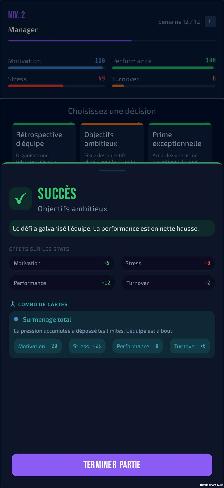
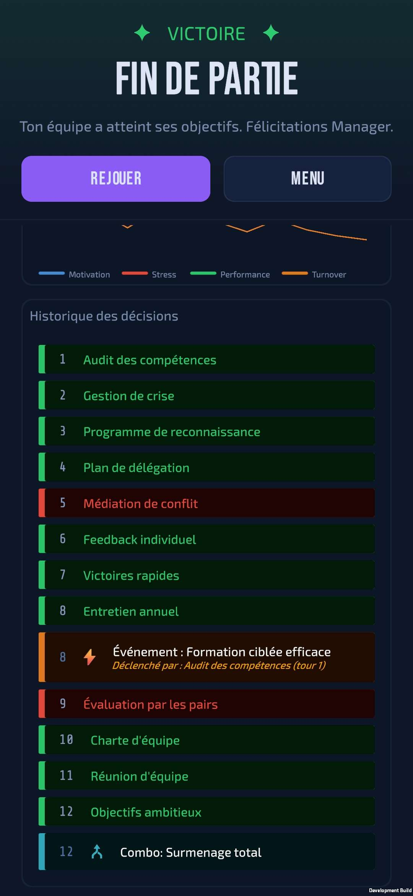

# Decision Manager

A mobile serious game about managerial decision-making and human resource management under uncertainty.

Built with Unity for Android, Decision Manager puts you in the role of a newly appointed manager responsible for balancing your team's performance and well-being over 12 weeks.

The API connected to the game is here: [DecisionManager API](https://github.com/enzo405/Decision-Manager-API) (ASP.NET Core 10 + PostgreSQL)

---

## Screenshots

| Loading | Menu | How To Play |
|:---:|:---:|:---:|
|  |  |  |

| Card Selection | Decision + Event | Decision + Combo |
|:---:|:---:|:---:|
|  |  |  | 

| Collection (Low) | Collection (High) | Collection |
|:---:|:---:|:---:|
|  |  |  |

| GameOver (Win) | GameOver (defeat) | GameOver (combo) |
|:---:|:---:|:---:|
|  |  |  |

---

## Concept

Each turn, the player chooses one of three decision cards — such as organizing a team meeting, setting ambitious goals, or launching a training program. Every decision has a success probability that can be modified by your team's current state, and affects four key statistics:

- **Motivation** — team engagement
- **Stress** — pressure felt by the team
- **Performance** — overall productivity
- **Turnover** — risk of team members leaving

**Adaptive card pool** — The game features a sophisticated card pool system that responds to both your recent decisions and your team's current state. Cards unlock based on multiple factors: some appear after playing specific prerequisite cards, others emerge when your team faces crises (high stress, low motivation), and advanced strategic cards require sustained investment across your entire game. This creates unique narratives where early choices shape available options, while the game adapts dynamically to success and failure.

**Card combos** — Successfully executing specific combinations of decisions triggers special synergy events with unique consequences. These combo events replace random events when they occur, rewarding strategic planning across multiple turns.

**Random events** — Each card can trigger delayed consequences that may occur 1-7 weeks after the decision. For example, launching an Agile transformation might trigger resistance 2-5 weeks later. Each event has a probability of occurring within its defined week range, simulating the unpredictable ripple effects of managerial decisions.

---

## Pedagogical Goals

- Understand the human consequences of managerial decisions
- Learn to manage risk and uncertainty under changing conditions
- Identify the fragile balance between performance and well-being
- Experience the delayed and unpredictable consequences of decisions
- Develop a medium to long-term strategic vision
- Recognize how early decisions constrain or enable future options
- Discover synergies between complementary management practices
- Balance reactive firefighting with proactive strategic investments
- Adapt decision-making to team state and context

---

## Tech Stack

- **Engine**: Unity 6 (2D)
- **Language**: C#
- **Platform**: Android
- **Orientation**: Portrait
- **Localization**: English / French (via Unity Localization package)
- **Backend**: [DecisionManager API](https://github.com/enzo405/Decision-Manager-API) (ASP.NET Core 10 + PostgreSQL)

---

## Gameplay

### Core Loop
1. Player selects one of three decision cards from an **adaptive pool** based on recent decisions, team state, and unlock requirements
2. A probability roll determines success or failure (modified by stat-based penalties if team is struggling)
3. Stats update immediately
4. Combo detection — the game checks if the successful decision completes a card combo
5. Random events from previously played cards may trigger based on their week range and probability
6. Feedback popup explains what happened and why
7. Player clicks Continue — next turn begins

### Adaptive Card Pool System

The game features a **multi-tiered card pool** that creates unique narratives by adapting to your decisions and team state:

**Card Types:**

- **Universal Cards (15 cards)** — Always available foundation-building options with no unlock requirements. These Level 1 cards form the basis of all strategies. Examples: Team Meeting, One-on-One, Skills Audit, Conflict Mediation.

- **Reactive Cards (14 cards)** — Unlock based on your **last 3 decisions**, creating immediate narrative continuity. Playing "Team Meeting" makes "Team Charter" and "Internal Communication" available in subsequent turns. These represent tactical follow-ups and course corrections. Examples: Mentoring Session, Performance Review, Delegation Plan.

- **Emergency Cards (4 cards)** — Crisis intervention options TODO

- **Foundation Cards (11 cards)** — Rare strategic achievements requiring sustained effort. These Level 4-5 cards unlock only when you've successfully played **all** their prerequisites throughout your entire game history. Examples: Culture Revamp (requires Team Charter + Strategic Retreat + Wellness Program), Predictive Analytics (requires Performance Review + Skills Audit + Process Optimization). **Foundation cards are aspirational** — most 12-turn games won't unlock them, but they reward consistent long-term planning.

### Stat-Based Difficulty

Success probability is **not fixed** — it adapts to your team's state through stat-based penalties:

**Examples:**
- Attempting "Agile Transformation" when Stress > 75 → -15% success chance
- Playing "Team Charter" when Motivation < 40 → -10% success chance
- Trying "Delegation Plan" when Performance < 50 → -10% success chance
- Launching "Team Restructuring" when Turnover > 60 → -15% success chance

This creates realistic management challenges: risky decisions become even riskier when your team is struggling. The game punishes poor timing and rewards situational awareness.

### Card Combos

**Card combos** reward strategic thinking by triggering special synergy events when you successfully execute specific combinations of decisions.

**How combos work:**
- Each combo requires **all** of its trigger cards to have been played successfully across your game history
- When you play the final card in a combo, a special synergy event triggers **instead of** a random event
- Each combo can only trigger **once per game**
- Combos are tracked and displayed in the game over screen

**Example combos:**
- **"Strong Team Culture"** — Successfully play Team Meeting + Team Charter → Bonus to motivation and cohesion
- **"Data-Driven Excellence"** — Successfully play Skills Audit + Performance Review + Predictive Analytics → Major performance boost
- **"Burnout Prevention"** — Successfully play Wellness Program + Flexible Remote Work → Significant stress reduction

Combos add a **medium-term strategic layer** beyond individual card effects, encouraging players to plan 3-5 turns ahead and discover powerful synergies between complementary management practices.

### Win / Loss Conditions

**Victory** — survive 12 weeks while keeping:
- Stress below the threshold
- Turnover under control
- Performance above the minimum

**Defeat** triggered by:
- **Burnout** — stress too high
- **Massive departures** — turnover too high
- **Poor performance** — performance too low

### Difficulty Scaling
Thresholds tighten as the player levels up. Negative effects on failed cards are amplified by 5% per level.

---

## Random Events

Each card carries **random events** — delayed consequences that may trigger in the weeks following your decision.

**How random events work:**
- Each card has 0-3 events attached to it
- When you play a card, its events enter a queue
- Each event has:
  - A **week range** (e.g., triggers 2-5 weeks after the card was played)
  - A **probability** of occurring (e.g., 40% chance)
- Every turn, the game checks all queued events within their week range and rolls for each
- **Only one event can trigger per turn** (unless a combo triggers, which replaces random events)

**Example:**
- Turn 2: You play "Agile Transformation"
- Turn 4-7: Event "Resistance to change resurfaces" can trigger (30% chance each turn)
- Turn 5: Event triggers → Team stress increases, motivation drops
- The event is removed from the queue (can't trigger again)

This simulates the **delayed, unpredictable ripple effects** of managerial decisions. A decision that seemed successful can create problems weeks later.

---

## Localization

The game is fully bilingual (English / French):
- All card names, descriptions, success/failure messages
- All UI labels and instructions
- All random event messages
- All combo event messages
- Language can be switched from the main menu
- Player's language preference is saved and persists across sessions

---

## Progression System

- Players earn XP each turn (base + bonus for good decisions)
- Level up unlocks new, more complex decision cards
- Progression persists across games via the backend API
- 20 levels — from **Manager Junior** to **Directeur Exécutif**

| Level | Title |
|---|---|
| 1 | Manager Junior |
| 2-3 | Manager |
| 4-5 | Manager Confirmé |
| 6-7 | Manager Senior |
| 8-10 | Directeur |
| 11+ | Directeur Exécutif |

---

## Cards

40 decision cards spread across 5 unlock levels and 4 card types.

Each card has:
- A base success probability modified by stat-based penalties
- Primary effects on success
- Secondary effects on failure
- A risk level (Low / Medium / High)
- A card type (Universal / Reactive / Emergency / Foundation) indicating primary unlock method
- Card requirements (optional) — prerequisite cards that must be played
- Stat unlock thresholds (optional) — team state conditions that unlock the card (works on ANY card type)
- Stat risk penalties (optional) — success probability penalties when team stats are poor
- Combo participation (optional) — cards may be part of one or more combo triggers
- Random events (0-3 per card) — delayed consequences with week ranges and probabilities
- Bilingual pedagogical feedback messages (EN/FR)

Card Unlock System:
- Cards can unlock through multiple paths (stat thresholds OR requirements)
- Stat thresholds are checked FIRST for all card types
- If no stat conditions met, falls back to type-specific logic
- This creates adaptive gameplay where cards appear/disappear based on both decisions and team state

Card Types:
- Universal (15) — Foundation-building cards, always available
- Reactive (14) — Unlock when ANY prerequisite was played in the last 3 turns
- Emergency (4) — Crisis intervention cards unlocking based on recent context
- Foundation (11) — Strategic achievements unlocking when ALL prerequisites are met across the full game

---

## Backend Integration

Decision Manager connects to the [DecisionManager API](https://github.com/enzo405/Decision-Manager-API) to:
- Persist player progression across game sessions
- Dynamically fetch cards and their associated events based on selected language
- Deliver card types, requirements, and stat unlock thresholds for the adaptive card pool
- Provide stat-based probability penalties for dynamic difficulty
- Provide card combo definitions and trigger conditions
- Remotely configure game settings and defeat conditions without a game update

Player identity is based on `SystemInfo.deviceUniqueIdentifier` — no login required.

---

## Known Limitations

- `deviceUniqueIdentifier` resets on app reinstall on Android 10+ — progression may be lost