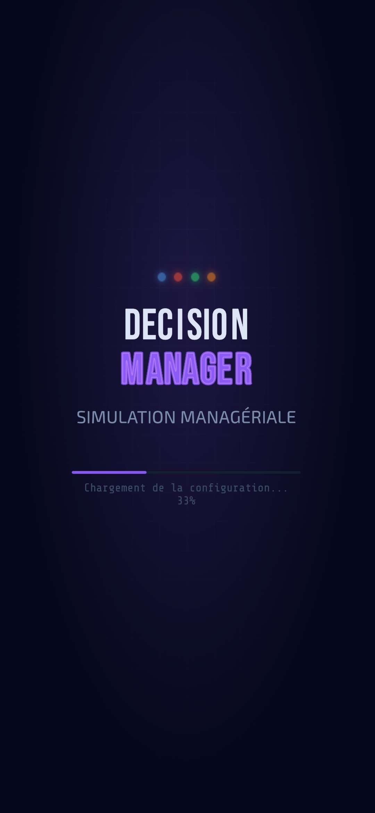
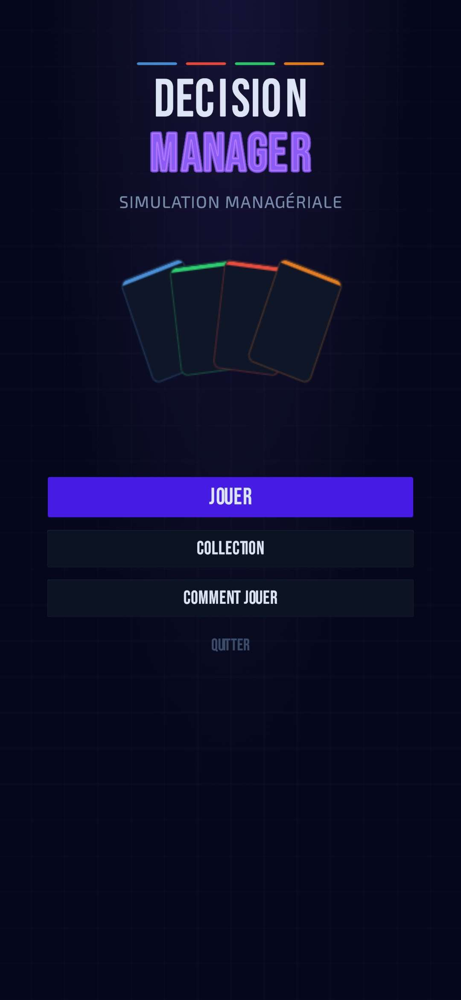
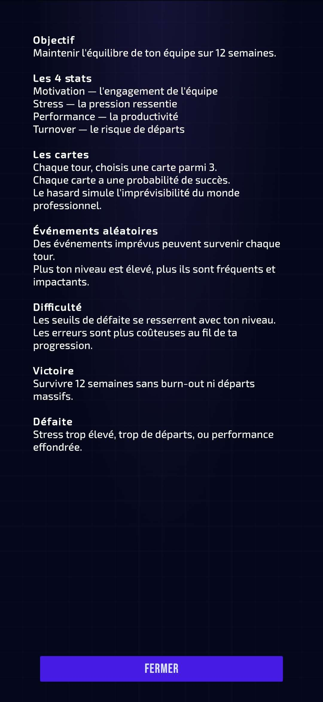
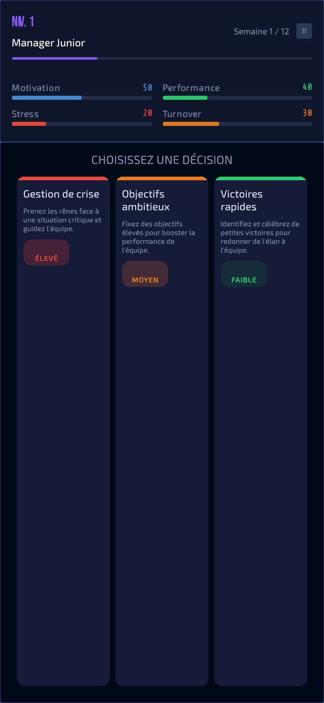
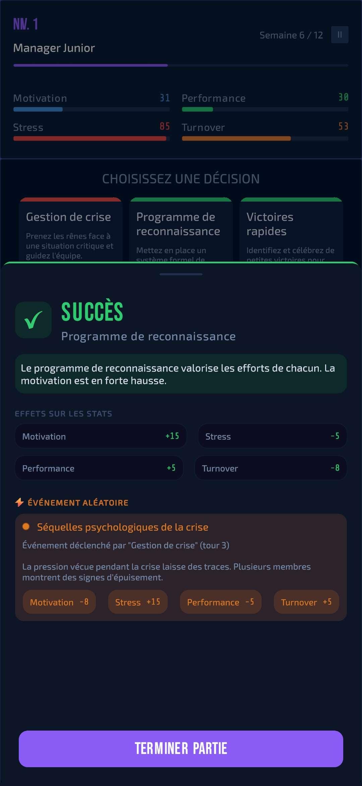
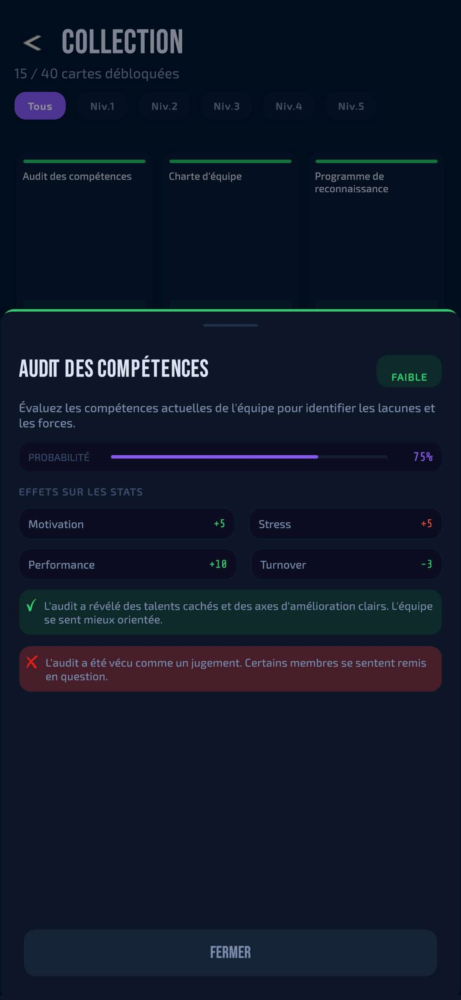
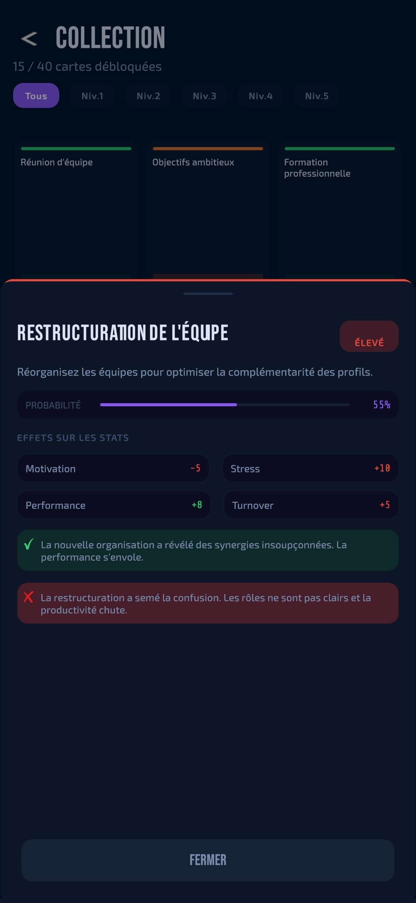
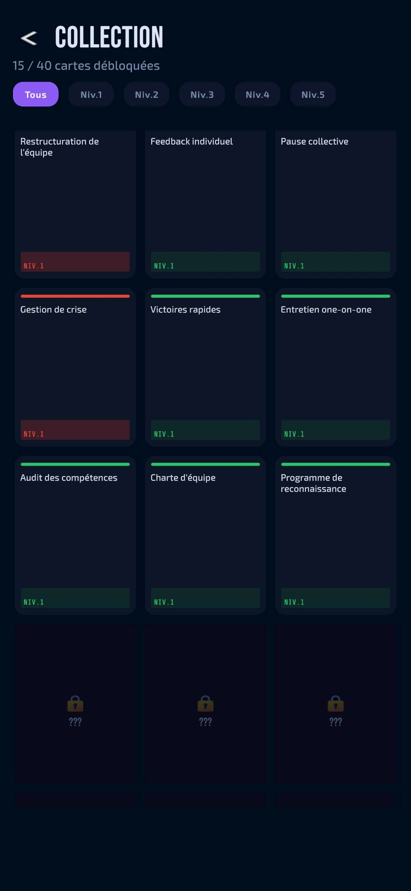
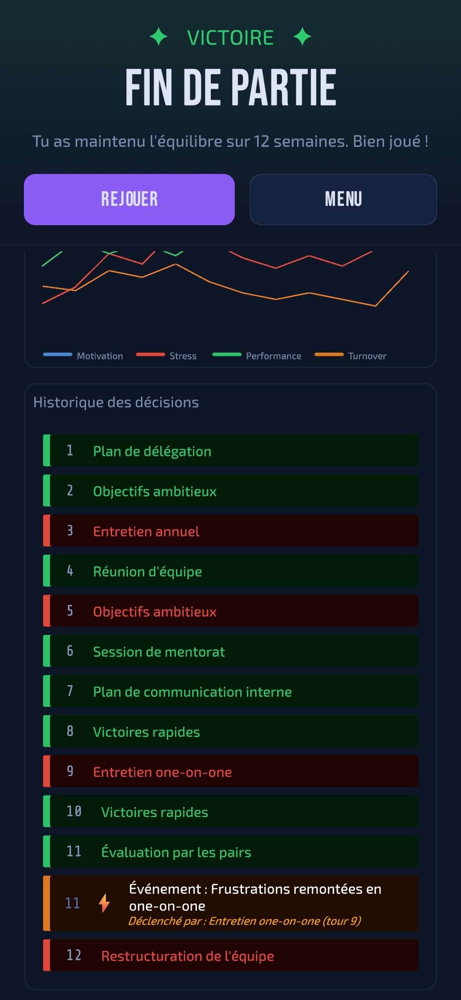
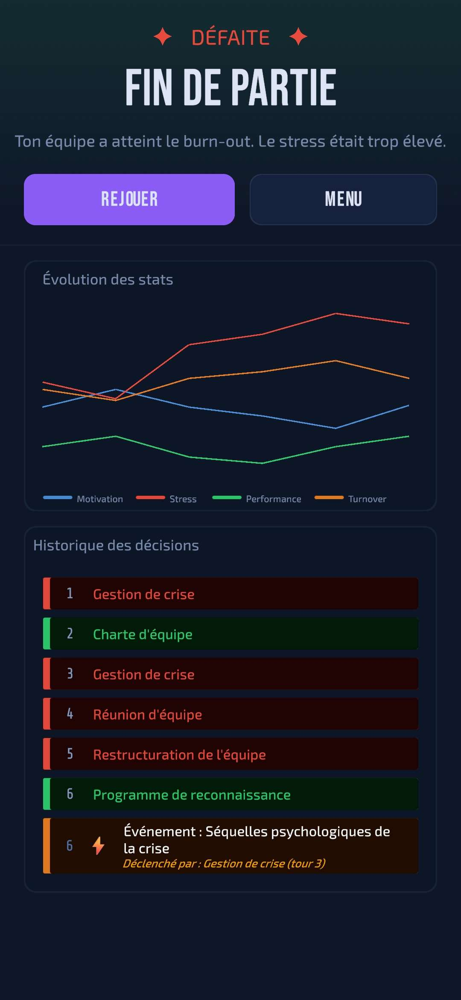

# Decision Manager

A mobile serious game about managerial decision-making and human resource management under uncertainty.

Built with Unity for Android, Decision Manager puts you in the role of a newly appointed manager responsible for balancing your team's performance and well-being over 12 weeks.

The API connected to the game is here: [DecisionManager API](https://github.com/enzo405/Decision-Manager-API) (ASP.NET Core 10 + PostgreSQL)

---

## Screenshots

| Loading | Menu | How To Play |
|:---:|:---:|:---:|
|  |  |  |

| Card Selection | Decision + Event |
|:---:|:---:|
|  |  | 

| Collection (Low) | Collection (High) | Collection |
|:---:|:---:|:---:|
|  |  |  |

| GameOver (Win) | GameOver (defeat) |
|:---:|:---:|
|  |  |

---

## Concept

Each turn, the player chooses one of three decision cards — such as organizing a team meeting, setting ambitious goals, or launching a training program. Every decision has a success probability and affects four key statistics:

- **Motivation** — team engagement
- **Stress** — pressure felt by the team
- **Performance** — overall productivity
- **Turnover** — risk of team members leaving

**Decision chains and smart card pool** — Your recent choices shape future options. The game features a sophisticated card pool system that adapts to your playstyle, creating unique narratives each playthrough.

**Card combos** — Successfully executing specific combinations of decisions triggers special synergy events with unique consequences. These combo events replace random events when they occur, rewarding strategic planning across multiple turns.

Each card may also carry **deferred events** — consequences that trigger in the turns following the decision, simulating the delayed and unpredictable nature of managerial choices.

Random events can occur each turn (unless a combo is triggered). Difficulty scales with the player's level — thresholds tighten and negative effects become more impactful.

---

## Pedagogical Goals

- Understand the human consequences of managerial decisions
- Learn to manage risk and uncertainty
- Identify the fragile balance between performance and well-being
- Experience the delayed consequences of decisions
- Develop a medium to long-term strategic vision
- Recognize how early decisions constrain or enable future options
- Discover synergies between complementary management practices
- Balance reactive firefighting with proactive strategic investments

---

## Tech Stack

- **Engine**: Unity 6 (2D)
- **Language**: C#
- **Platform**: Android
- **Orientation**: Portrait
- **Localization**: English / French (via Unity Localization package)
- **Backend**: [DecisionManager API](https://github.com/enzo405/Decision-Manager-API) (ASP.NET Core 10 + PostgreSQL)

---

## Gameplay

### Core Loop
1. Player selects one of three decision cards from a **smart pool** that adapts to recent decisions and playstyle
2. A probability roll determines success or failure
3. Stats update immediately
4. Combo detection — the game checks if the successful decision completes a card combo
5. Deferred events from previously played cards are evaluated
6. A random event may trigger (only if no combo was triggered)
7. Feedback popup explains what happened and why
8. Player clicks Continue — next turn begins

### Adaptive Card Pool System

The game features a **multi-tiered card pool** that creates unique narratives by adapting to your decisions:

**Card Types:**

- **Universal Cards (15 cards)** — Always available foundation-building options. These Level 1 cards form the basis of all strategies and have no unlock requirements. Think: Team Meeting, One-on-One, Skills Audit, Conflict Mediation.

- **Reactive Cards (14 cards)** — Unlock based on your **last 3 decisions**, creating immediate narrative continuity. Playing "Team Meeting" makes "Team Charter" and "Internal Communication" available next turn. These represent tactical follow-ups and course corrections.

- **Emergency Cards (4 cards)** — Crisis intervention options that unlock based on recent context. Appear when you need firefighting solutions like "Crisis Management" after major setbacks or "Wellness Program" when team pressure builds.

- **Foundation Cards (11 cards)** — Rare strategic achievements requiring sustained effort across multiple turns. These Level 4-5 cards unlock only when you've successfully played **all** their prerequisites throughout your game. Think: Culture Revamp (requires Team Charter + Strategic Retreat + Wellness Program), or Predictive Analytics (requires Performance Review + Skills Audit + Process Optimization). **Foundation cards are aspirational** — most games won't unlock them, but they reward consistent long-term planning.

**How it works:**

Turn 1: Only Universal cards available → choose your foundational approach

Turn 2-4: Reactive cards begin appearing based on Turn 1-3 choices → narrative branches emerge

Turn 5-8: Smart pool expands with more Reactive options → your playstyle becomes clearer

Turn 9-12: Foundation cards *might* unlock if you've met all prerequisites → strategic payoff

**Example progression:**

**People-First Path:**
- Turn 1: Play "One-on-One" (Universal)
- Turn 2: "Mentoring Session" (Reactive) unlocks → play it
- Turn 4: "Leadership Development" (Reactive) unlocks → play it
- Turn 8: "Succession Planning" (Foundation) unlocks if you've also played other prerequisites

**Process-Driven Path:**
- Turn 1: Play "Ambitious Goals" (Universal)
- Turn 3: "Process Optimization" (Reactive) unlocks → play it
- Turn 5: "Agile Transformation" (Reactive) unlocks → play it
- Turn 10: "Predictive Analytics" (Foundation) unlocks if prerequisites met

The smart pool creates **emergent storytelling** where your early choices guide which options become available, without forcing a single "correct" path. Multiple playstyles can succeed, each unlocking different advanced cards.

### Card Combos

**Card combos** reward strategic thinking by triggering special synergy events when you successfully execute specific combinations of decisions.

**How combos work:**
- Each combo requires **all** of its trigger cards to have been played successfully across your game history
- When you play the final card in a combo, a special synergy event triggers **instead of** a random event
- Each combo can only trigger **once per game**
- Combos are tracked and displayed in the game over screen

**Example combos:**
- **"Strong Team Culture"** — Successfully play Team Meeting + Team Charter → Bonus to motivation and cohesion
- **"Data-Driven Excellence"** — Successfully play Skills Audit + Performance Review + Predictive Analytics → Major performance boost
- **"Burnout Prevention"** — Successfully play Wellness Program + Flexible Remote Work → Significant stress reduction

Combos add a **medium-term strategic layer** beyond individual card effects, encouraging players to plan 3-5 turns ahead and discover powerful synergies between complementary management practices.

### Win / Loss Conditions

**Victory** — survive 12 weeks while keeping:
- Stress below the threshold
- Turnover under control
- Performance above the minimum

**Defeat** triggered by:
- **Burnout** — stress too high
- **Massive departures** — turnover too high
- **Poor performance** — performance too low

### Difficulty Scaling
Thresholds tighten as the player levels up. Negative effects on failed cards are amplified by 5% per level.

---

## Event System

The game features two types of events that can occur during gameplay:

### Random Events
Each card can carry one or more **events** — consequences that may trigger in a defined week range after the card is played.
Only one random event can occur per turn.

For example, playing *Agile Transformation* at week 3 might trigger *"Resistance to change resurfaces"* between weeks 2 and 7 after the initial decision.

Each deferred event has:
- A **week range** (relative to when the card was played)
- A **chance** of triggering
- **Stat effects**

This system simulates the delayed and compounding consequences of managerial decisions.

### Combo Events
Special synergy events that trigger when you successfully complete a card combination. **Combo events replace random events** — when a combo triggers, no random event occurs that turn. Each combo can only trigger once per game, creating unique moments that reward strategic planning.

This layered event system simulates the delayed, compounding, and synergistic consequences of managerial decisions.

---

## Localization

The game is fully bilingual (English / French):
- All card names, descriptions, success/failure messages
- All UI labels and instructions
- All deferred event messages
- All combo event messages
- Language can be switched from the main menu
- Player's language preference is saved and persists across sessions

---

## Progression System

- Players earn XP each turn (base + bonus for good decisions)
- Level up unlocks new, more complex decision cards
- Progression persists across games via the backend API
- 20 levels — from **Manager Junior** to **Directeur Exécutif**

| Level | Title |
|---|---|
| 1 | Manager Junior |
| 2-3 | Manager |
| 4-5 | Manager Confirmé |
| 6-7 | Manager Senior |
| 8-10 | Directeur |
| 11+ | Directeur Exécutif |

---

## Cards

40 decision cards spread across 5 unlock levels and 4 card types.

Each card has:
- A success probability
- Primary effects on success
- Secondary effects on failure
- A risk level (Low / Medium / High)
- A **card type** (Universal / Reactive / Emergency / Foundation)
- Bilingual pedagogical feedback messages (EN/FR)
- **Card requirements** — conditions that must be met for the card to appear in the smart pool
- **Combo participation** — cards may be part of one or more combo triggers
- Deferred events with delayed stat consequences

**Card Types:**
- **Universal (15)** — Foundation-building cards, always available
- **Reactive (14)** — Unlock when ANY prerequisite was played in the last 3 turns
- **Emergency (4)** — Crisis intervention cards unlocking based on recent context
- **Foundation (11)** — Strategic achievements unlocking when ALL prerequisites are met across the full game

---

## Backend Integration

Decision Manager connects to the [DecisionManager API](https://github.com/enzo405/Decision-Manager-API) to:
- Persist player progression across game sessions
- Dynamically fetch cards and their associated events based on selected language
- **Deliver card types and requirements** for the adaptive card pool system
- **Provide card combo definitions** and trigger conditions
- Remotely configure game settings and defeat conditions without a game update

Player identity is based on `SystemInfo.deviceUniqueIdentifier` — no login required.

---

## Known Limitations

- `deviceUniqueIdentifier` resets on app reinstall on Android 10+ — progression may be lost